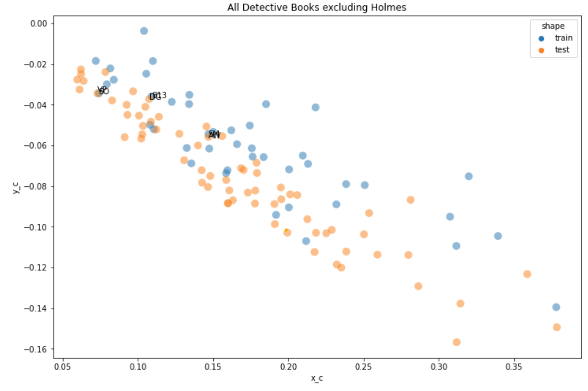
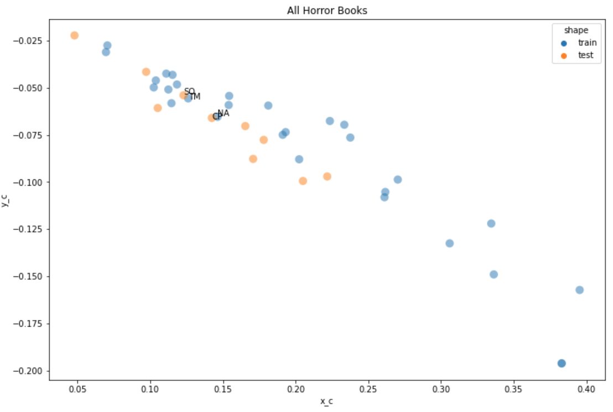

# Book Recommendation Classifier
Gaby Chu and Estelle Hooper authored this research report as part of the midterm miniproject for INFO 3350: Text Mining for History and Literature in spring 2022. We were given a corpus of 160 novels from [Project Gutenberg](gutenberg.org). The assignment was to simply "learn something about them" using NLP tools learned in class thus far (we scored 100/100!).

The techniques implemented were vectorization, identifying stopwords, normalization, standardization, matrix fitting, and modeling using naive bayes and logistic regression.

# Table of Contents

- [Book Recommendation Classifier](#book-recommendation-classifier)
- [Table of Contents](#table-of-contents)
- [Overview](#overview)
    - [Motivation](#motivation)
    - [Project](#project)
- [Installation and Setup](#installation-and-setup)
    - [File Structure](#file-structure)
- [Data](#data)
- [Results](#results)
- [Future Work](#future-work)
- [Acknowledgements/References](#acknowledgementsreferences)
- [License](#license)

# Overview

### Motivation

When selecting consuming media, especially books, people often lean towards one genre or narrative because of limited time and attention; readers are hesitant to explore new narratives out of fear for disliking unfamilar content.

> **Research Question:**
How can we recommend books of other genres to lovers of a single genre?

We hypothesize that to trust another genre, there must be shared qualities with a reader's favorite genre. For example, detective fans could enjoy romance because both involve complex character motivations and relationships.

### Project

The dataset we received was very versatile, as detailed in the [Data](#data) section. However, what particularly caught our interest was its genre distribution, comprised of a good sample of horror novels (18%) and detective novels (31%), and a miscellaneous group (51%) spread thinly across 14 other genres.

 We want to see how close these "other novels" are to either the horror genre or detective genre. We will train a classifier using the detective and horror novels, and run that classifier on the "other" novels. Those "other" novels will receive a horror or detective label (despite not being canonically those genres). With these classifier outcomes, we will recommend the "other" books labeled "detective" to fans of the detective genre and those labeled "horror" to the horror genre. For example, the classifier ran on *Harry Potter*, a fantasy series, and gave it a horror label, we would recommend horror fans to read *Harry Potter.*

# Installation and Setup

[(Back to top)](#table-of-contents)

This project was made with `python 3.9.12` with the following dependencies:
```
string
numpy
pandas
matplotlib
os
seaborn
scikit-learn
```

`mp_03_research_report.ipynb` contains the final, written report and is both a fully executable file containing the code used to generate results. This project was written entirely in Jupyter Lab. The rest of the jupyter notebook files contain exploratory data analysis, drafts, and extra code used that did not need to be included in the final report.

### File Structure
[(Back to top)](#table-of-contents)

```
book-recommendation
├── mp_03_research_report.ipynb
├── books
│   ├── class_corpus_metadata.csv
│   ├── all novel .txt files
│   ├── Code.ipynb
│   ├── Code-Copy1.ipynb
│   ├── mp_03_research_report.ipynb
|   └── mp_03_responsibility_statement.ipynb
├── LICENSE
└── README.md
```

# Data
[(Back to top)](#table-of-contents)

The corpus was selected by INFO 3350 staff from [Project Gutenberg](gutenberg.org). These files were downloaded by students, who cleaned the .txt files, such deleting as the title page, table of contents, and other extraneous information.

While our research focused on predicting genre, this dataset has the potential to be used for other NLP projects, as seen in the breadth of other students' projects. The metadata also includes the author's gender identity (all provided were binary), year published, and country published. Most of the books were published in the 19th and 20th centuries in either the U.S. or the U.K.

# Results

[(Back to top)](#table-of-contents)

We did not prioritize accuracy metrics because the testing data does not contain true detective or testing labels. We plotted the true (blue) and predicted detective novels (orange) using the vectorized features. Our book recommendations are the overlapping dots on the graph. We repeated this with the horror novel results, resulting in 5 total book recommendation pairings.



*Note: Sherlock Holmes' novels were outliers in the scatterplot so they were removed, hence the graph's title.*

**Detective Book Recommendations**

| Detective Book Title (training)| Recommendation Title (testing - predicted "detective")|
| ----------- | ----------- |
| The Secret of the Old Clock | Voodoo Planet|
| 813| The Picture of Dorian Gray|
| Agatha Webb |Silas Marner|



**Horror Book Recommendations**

| Horror Book Title (training)| Recommendation Title (testing - predicted "horror")|
| ----------- | ----------- |
| Northanger Abbey | Chaplet of Pearls|
| The Man| The Lances of Lynwood|

Overall, we didn't expect the recommendations we obtain from the classifer to be very great because it is only working with detective and horror, and it will be hard to find overlapping words with only those two genres and the various other genres in the corpus. We were excited that we even 5 pairs from the dataset!

# Future Work

[(Back to top)](#table-of-contents)

We would love to explore this project with a different corpus because it does not boast a incredible amount of books relative to the distribution of books in existence. Many of the authors were white, which greatly limits the diversity in the narratives. This again has effects on our results because we can not know how works by authors of color factor into the model and what effect this would have on our predictions and recommendations. We also noticed that most of our training data was authored by men while most of the testing data was authored by women. We would also be interested in training a classifier for more than two genres.

# Acknowledgements/References
[(Back to top)](#table-of-contents)

Thank you to [Project Gutenberg](gutenberg.org) and its effort to make texts more accessible for reading and for data science!

Thank you to Professor Wilkens and the INFO 3350 staff in assisting us with the project. Code used from lectures is cited in the final research report.

# License
[(Back to top)](#table-of-contents)

[GNU General Public License](https://www.gnu.org/licenses/gpl-3.0.en.html)
